# Mermaid 图表语法参考

各 Mermaid 图表类型的详细语法。仅阅读与你要创建的图表相关的章节，无需加载整个文件。

## 目录

- [流程图（`graph` / `flowchart`）](#流程图graph--flowchart)
- [时序图（`sequenceDiagram`）](#时序图sequencediagram)
- [类图（`classDiagram`）](#类图classdiagram)
- [状态图（`stateDiagram-v2`）](#状态图statediagram-v2)
- [ER 图（`erDiagram`）](#er-图erdiagram)
- [甘特图（`gantt`）](#甘特图gantt)
- [饼图（`pie`）](#饼图pie)
- [Git 图（`gitGraph`）](#git-图gitgraph)
- [用户旅程图（`journey`）](#用户旅程图journey)
- [思维导图（`mindmap`）](#思维导图mindmap)
- [时间线图（`timeline`）](#时间线图timeline)
- [象限图（`quadrantChart`）](#象限图quadrantchart)
- [其他图表类型](#其他图表类型)

---

## 流程图（`graph` / `flowchart`）

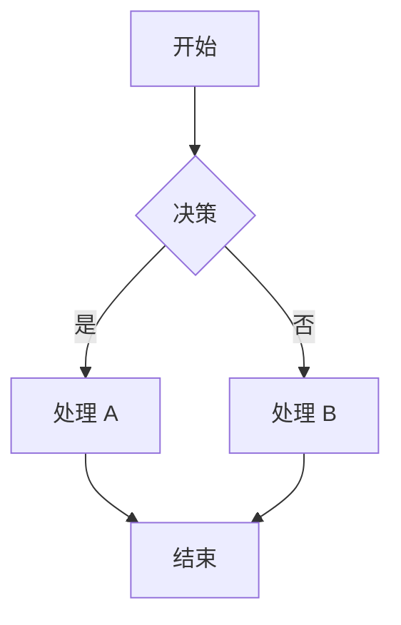

### 方向

| 关键字 | 方向 |
|--------|------|
| `TD` / `TB` | 从上到下 |
| `LR` | 从左到右 |
| `BT` | 从下到上 |
| `RL` | 从右到左 |

### 节点形状

| 语法 | 形状 |
|------|------|
| `A[文本]` | 矩形 |
| `A(文本)` | 圆角矩形 |
| `A([文本])` | 体育场形 |
| `A[[文本]]` | 子程序 |
| `A[(文本)]` | 数据库圆柱 |
| `A{文本}` | 菱形（决策） |
| `A((文本))` | 圆形 |
| `A>文本]` | 不对称形 |

### 连线样式

| 语法 | 样式 |
|------|------|
| `-->` | 实线带箭头 |
| `---` | 实线无箭头 |
| `-.-` | 虚线无箭头 |
| `-.->` | 虚线带箭头 |
| `==>` | 粗线带箭头 |
| `===` | 粗线无箭头 |
| `-- 文本 -->` | 带标签的箭头 |
| `-->|文本|` | 标签的另一种写法 |

### 子图

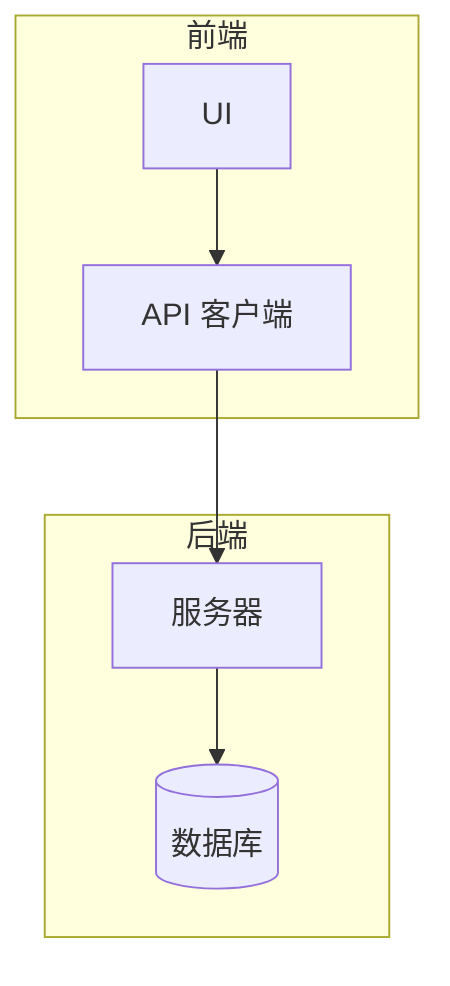

### 样式定制

```
classDef highlight fill:#f96,stroke:#333,stroke-width:2px;
class A highlight
linkStyle 1 stroke:#f00,stroke-width:2px;
```

---

## 时序图（`sequenceDiagram`）

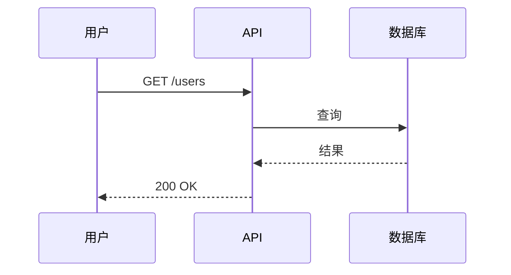

### 箭头类型

| 语法 | 样式 |
|------|------|
| `->>` | 实线带箭头 |
| `-->>` | 虚线带箭头 |
| `--)` | 实线开放式箭头 |
| `--)` | 虚线开放式箭头（用 `-->>` 表示闭合） |
| `-x` | 实线带 X（失败） |
| `--)` | 异步（开放式） |

### 激活与生命线

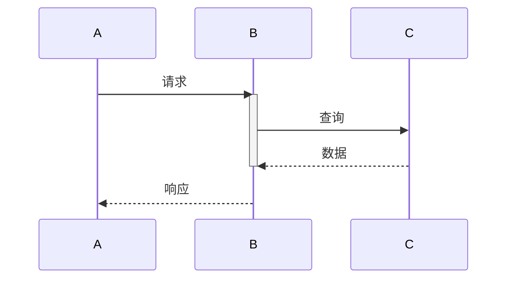

简写：`A->>+B: ...`（`+` 自动激活）`B-->>-A: ...`（`-` 自动取消激活）。

### 循环、alt、opt

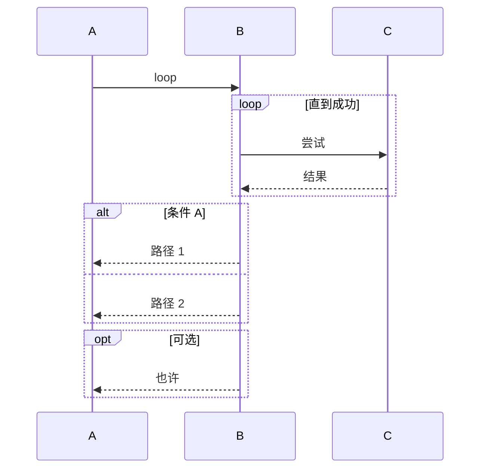

### 备注

```
Note over A,B: 共享备注
Note right of A: 针对 A 的备注
```

---

## 类图（`classDiagram`）

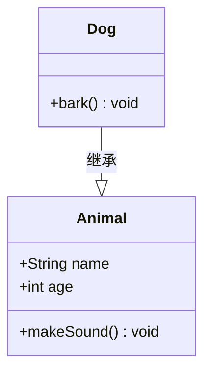

### 可见性

| 符号 | 可见性 |
|------|--------|
| `+` | 公有 |
| `-` | 私有 |
| `#` | 受保护 |
| `~` | 包级 |

### 关系

| 语法 | 含义 |
|------|------|
| `--|>` | 继承 |
| `..|>` | 实现（implements） |
| `--` | 关联 |
| `..>` | 依赖 |
| `*--` | 组合（composition） |
| `o--` | 聚合（aggregation） |
| `--` 加 `: 标签` | 带名称的关联 |

可加方向：`<--`、`<|--`、`<*--` 等。

### 泛型与构造型

```
class Shape~T~ {
    +T value
}
class Cache <<interface>> {
    +get(key) T
}
```

---

## 状态图（`stateDiagram-v2`）

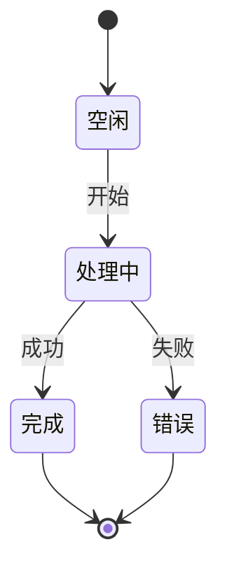

### 复合状态

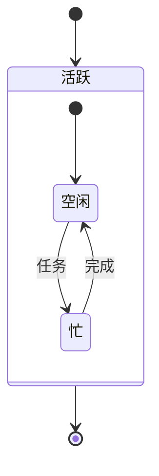

### Fork / Join

```
state Fork_state <<fork>>
state Join_state <<join>>
[*] --> Fork_state
Fork_state --> State1
Fork_state --> State2
State1 --> Join_state
State2 --> Join_state
Join_state --> [*]
```

---

## ER 图（`erDiagram`）

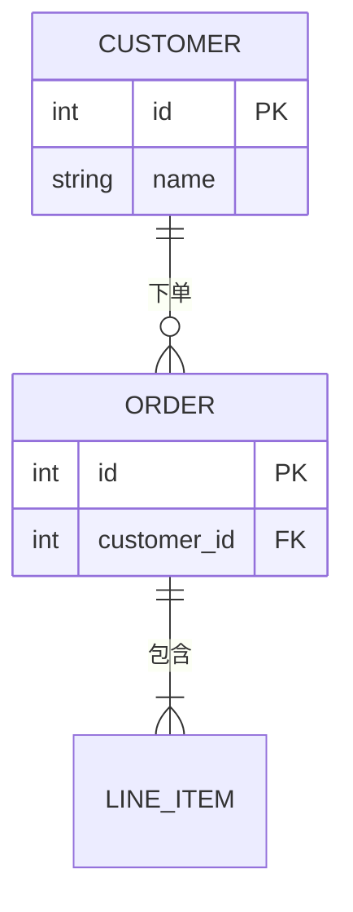

### 基数

| 语法 | 含义 |
|------|------|
| `||--||` | 恰好一个 |
| `|o--o|` | 零或一个 |
| `}o--o{` | 多对多 |
| `||--o{` | 一对多（零或多个） |
| `||--|{` | 一对多（一个或多个） |

格式：`<左侧基数>--<右侧基数>`。左侧 `|` 表示一，`}o` 表示多。

### 属性

```
ENTITY {
    type name PK     %% PK = 主键
    type name FK     %% FK = 外键
    type name
}
```

---

## 甘特图（`gantt`）

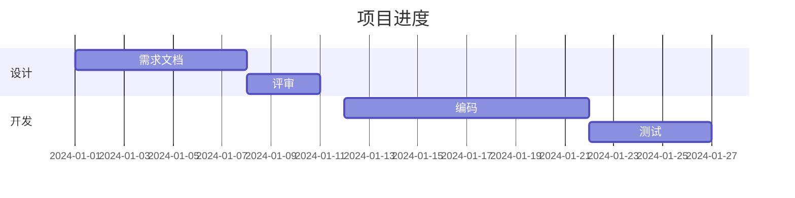

### 任务语法

```
<任务名> :<id>, <开始>, <时长>
<任务名> :<id>, after <其他 id>, <时长>
```

- `<开始>`：日期（需匹配 `dateFormat`）或 `after <id>`
- `<时长>`：如 `7d`、`2w`、`1h`
- 添加状态标志：`:a1, 2024-01-01, 7d, crit`

### 指令

| 指令 | 用途 |
|------|------|
| `dateFormat` | 输入日期格式（如 `YYYY-MM-DD`） |
| `axisFormat` | 轴上标签的显示格式 |
| `title` | 标题 |
| `section` | 分组 |
| `excludes` | 排除日期（如周末） |
| `todayMarker` | "今日"标记样式 |

---

## 饼图（`pie`）

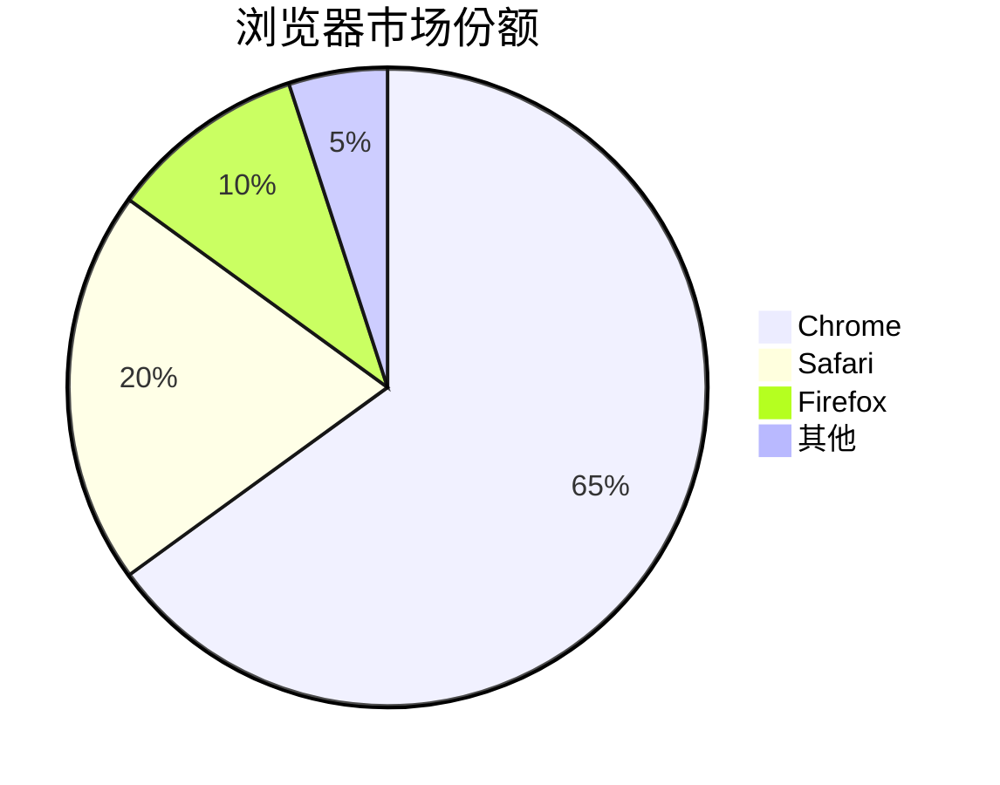

无额外指令：`pie [title <文本>]` 后跟 `"标签" : <数值>` 行。

---

## Git 图（`gitGraph`）

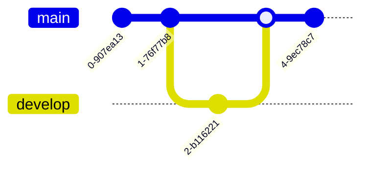

### 命令

| 命令 | 用途 |
|------|------|
| `commit` | 当前分支上提交 |
| `commit id: "msg"` | 带消息的提交 |
| `commit tag: "v1.0"` | 带 tag 的提交 |
| `branch <name>` | 创建分支 |
| `checkout <name>` | 切换分支 |
| `merge <name>` | 将某分支合并到当前分支 |
| `cherry-pick id: "xxx"` | 摘取某个提交 |

---

## 用户旅程图（`journey`）

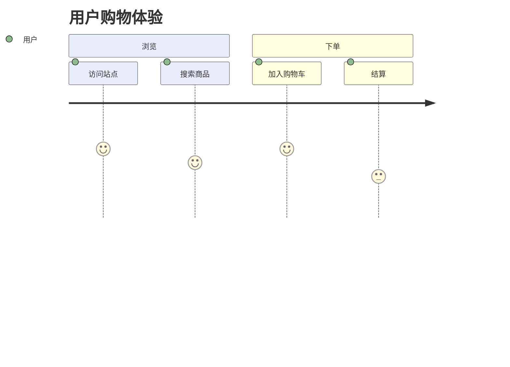

语法：`<任务名> : <满意度 1-5> : <参与者>`。`section` 用于分组。

---

## 思维导图（`mindmap`）

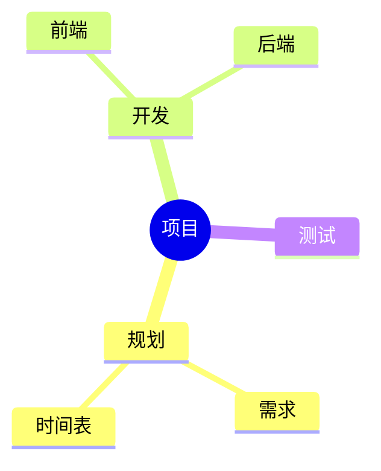

### 节点形状（缩进表示层级）

```
  root((圆形))      %% 双括号 = 圆形
    (圆角矩形)
    [矩形]
    {{六边形}}
    ((圆形))         %% 不能作为 root
```

---

## 时间线图（`timeline`）

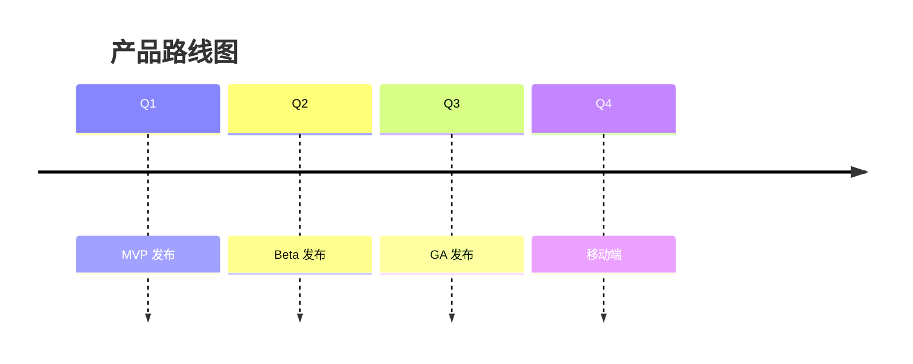

同一时间点多个事件：

```
    2024-01 : 设计完成
            : 规格冻结
    2024-02 : 开始编码
```

---

## 象限图（`quadrantChart`）

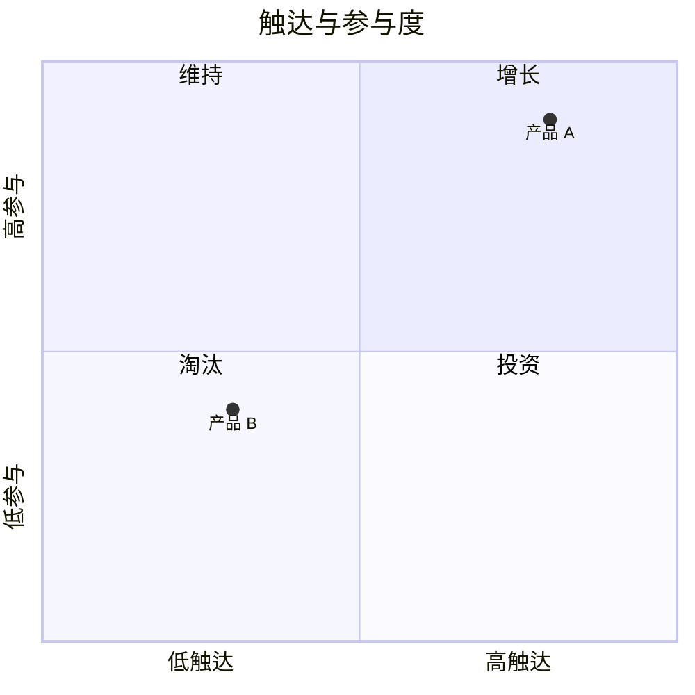

数据点用 `[x, y]` 给出，坐标范围为 0–1。

---

## 其他图表类型

Mermaid 还支持以下较少使用类型。完整语法请参考 [Mermaid 官方文档](https://mermaid.nodejs.cn/)。

- **C4 图**（`C4Context`、`C4Container`、`C4Component`）— C4 模型的软件架构图
- **需求图**（`requirementDiagram`）— 需求及其关系
- **桑基图**（`sankey-beta`）— 流量/数量流向图
- **XY 图表**（`xychart-beta`）— 柱状图与折线图
- **块图**（`block-beta`）— 基于块的架构图
- **数据包图**（`packet`）— 网络数据包结构
- **看板**（`kanban`）— 任务看板
- **架构图**（`architecture-beta`）— 系统架构
- **雷达图**（`radar-beta`）— 多维度对比
- **事件建模**（`architecture-beta` 变种）— 事件驱动设计
- **树状图**（`treemap`）— 层级矩形数据
- **韦恩图**（`venn`）— 集合交集
- **石川图/鱼骨图**（`ishikawa`）— 根因分析
- **Wardley 地图**（Wardley 变种）— 战略映射
- **Cynefin 框架**（Cynefin 变种）— 决策上下文
- **树视图**（`treeView`）— 层级文本树